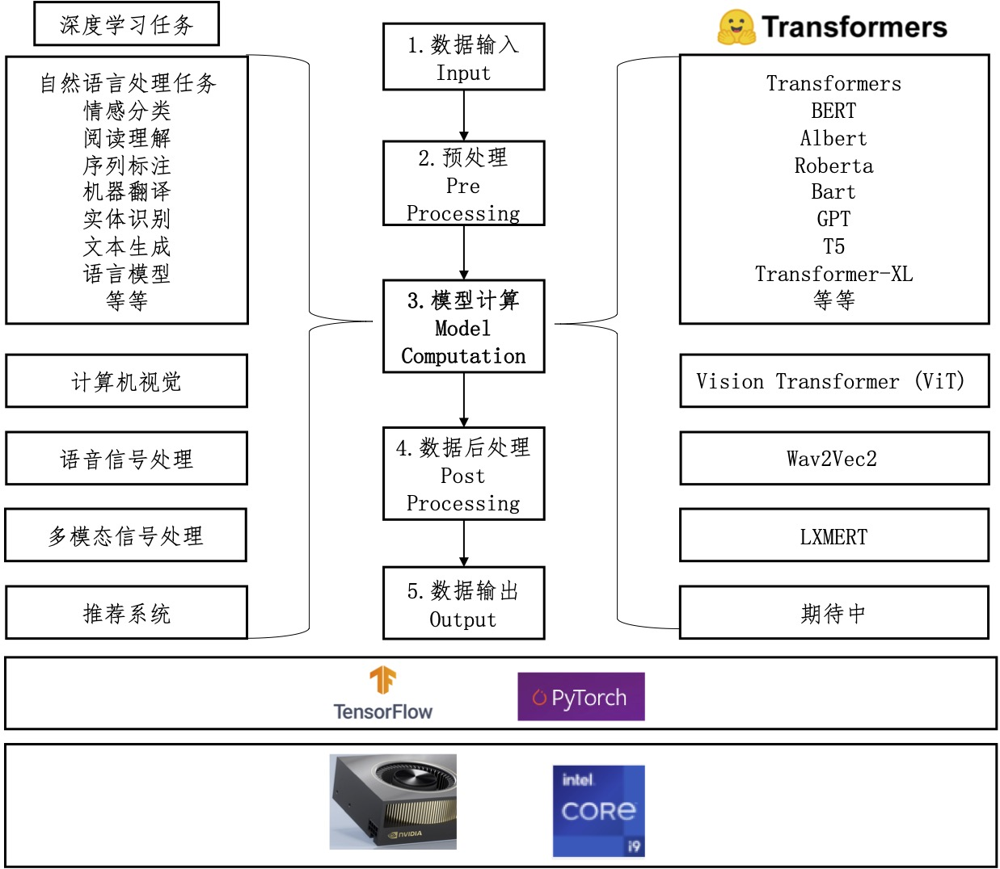

# transformers-quick-start-zh
we want to create a repo to illustrate usage of transformers in chinese.
# Transformers快速上手
在本项目中，我们希望能简洁得讲解transformer相关的模型原理和代码例子及其在各类深度学习任务中的应用。目前本项目中的讲解和例子主要基于[HuggingFace/transformers](https://github.com/huggingface/transformers)，由于[HuggingFace/transformers](https://github.com/huggingface/transformers)中计算机视觉的例子较少，后续会进一步扩充其他流行的cv代码库。

## transformers解决哪些深度学习任务？

### transformer应用-自然语言处理任务
- 使用tranformers中的预训练模型直接处理对应的深度学习任务。
- 选择一个合适的预训练模型（比如BERT），在自己的数据集上微调预训练模型，获得更好的模型效果。
1. [语言模型](https://github.com/datawhalechina/transformers-quick-start-zh/blob/main/%E8%87%AA%E7%84%B6%E8%AF%AD%E8%A8%80%E5%A4%84%E7%90%86%E4%BB%BB%E5%8A%A1/1-language_modeling-%E8%AF%AD%E8%A8%80%E6%A8%A1%E5%9E%8B.ipynb) Language Modeling
2. [机器翻译](https://github.com/datawhalechina/transformers-quick-start-zh/blob/main/%E8%87%AA%E7%84%B6%E8%AF%AD%E8%A8%80%E5%A4%84%E7%90%86%E4%BB%BB%E5%8A%A1/2-translation-%E6%9C%BA%E5%99%A8%E7%BF%BB%E8%AF%91.ipynb)，Translation
3. [抽取式问答/机器阅读理解](https://github.com/datawhalechina/transformers-quick-start-zh/blob/main/%E8%87%AA%E7%84%B6%E8%AF%AD%E8%A8%80%E5%A4%84%E7%90%86%E4%BB%BB%E5%8A%A1/3-question_answering-%E6%9C%BA%E5%99%A8%E9%97%AE%E7%AD%94.ipynb)，Extractive Question Answering
4. [摘要生成](https://github.com/datawhalechina/transformers-quick-start-zh/blob/main/%E8%87%AA%E7%84%B6%E8%AF%AD%E8%A8%80%E5%A4%84%E7%90%86%E4%BB%BB%E5%8A%A1/4-summarization-%E6%91%98%E8%A6%81%E7%94%9F%E6%88%90.ipynb) summarization
5. [token分类](https://github.com/datawhalechina/transformers-quick-start-zh/blob/main/%E8%87%AA%E7%84%B6%E8%AF%AD%E8%A8%80%E5%A4%84%E7%90%86%E4%BB%BB%E5%8A%A1/5-token_classification-%E8%AF%8D_%E7%AC%A6%E5%8F%B7_token%E7%BA%A7%E5%88%AB%E5%88%86%E7%B1%BB%E4%BB%BB%E5%8A%A1.ipynb)（命名实体识别、词性标注等）
6. 序列分类（通常是一个句子/文本段落），Sequence Classification
7.  对话系统，Dialogue

### transformer应用-计算机视觉
1. 图像分类
2. 图像检测
3. 图像分割
### transformer应用-语音信号处理
### transformer应用-推荐系统

## transformers的原理是什么？
1. [图解attention](https://github.com/datawhalechina/transformers-quick-start-zh/blob/main/transformer%E5%9F%BA%E6%9C%AC%E5%8E%9F%E7%90%86%E8%AE%B2%E8%A7%A3/1-%E5%9B%BE%E8%A7%A3attetion.md)
2. [图解transformer](https://github.com/datawhalechina/transformers-quick-start-zh/blob/main/transformer%E5%9F%BA%E6%9C%AC%E5%8E%9F%E7%90%86%E8%AE%B2%E8%A7%A3/2-%E5%9B%BE%E8%A7%A3transformer.md)
3. [图解BERT](https://github.com/datawhalechina/transformers-quick-start-zh/blob/main/transformer%E5%9F%BA%E6%9C%AC%E5%8E%9F%E7%90%86%E8%AE%B2%E8%A7%A3/3-%E5%9B%BE%E8%A7%A3BERT.md)
4. [图解GPT](https://github.com/datawhalechina/transformers-quick-start-zh/blob/main/transformer%E5%9F%BA%E6%9C%AC%E5%8E%9F%E7%90%86%E8%AE%B2%E8%A7%A3/4-%E5%9B%BE%E8%A7%A3GPT.md)

## transformers如何改进？
1. 知识蒸馏
2. 浮点数量化
3. 长序列transformers
4. ...
## 环境配置
现在以mac电脑为例，依次执行以下步骤：

将本项目clone到本地，打开mac/linux的命令行窗口：
```
git clone git@github.com:datawhalechina/transformers-quick-start-zh.git
```
进入项目文件夹：
```
cd transformers-quick-start-zh
```
创建属于本项目的python3的环境：
```
virtualenv -p python3 venv
```
激活本项目的python3环境：
```
source activate venv/bin/activate：
```
安装python3.6依赖的软件包：
```
pip install -r requirements.txt
```

## Transformers具体使用和实践？


Transformer是一种神经网络结构，它和CNN（卷积神经网络）和LSTM（长短期记忆神经网络）一样，都能被拿来解决各类深度学习任务。如果初学者不明白CNN和LSTM，则可以将transformer/cnn/lstm想像成一种函数映射关系，这些函数映射能将输入数据映射成我们想要的输出数据（比如将输入的一句话：transformer中文快速上手很棒，映射成输出：0或者1。输出的0或者1分别代表负向情感和正向情感）。

在开始学习transformer之前，我们希望能知道目前的transformer结构及其变体能帮助我们很好的解决哪些深度学习任务？


<center>图1 深度学习任务和transformer关系图</center>

如深度学习任务和transformer关系图所示，**左边**展示了Huggingface/transformers代码库能处理的各种深度学习任务，**中间**展示的是处理这些任务的统一流水线（pipeline），**右边**展示的是与任务对应的transformers模型名称，**下方**表示用transformers解决这些深度学习任务可以在cpu或者gpu上进行，可以使用tensorflow也可以使用pytorch框架。

为了保持逻辑上的一致性并且便于读者理解，对于任何一个深度学习任务，transformers在处理的时候基本都会遵循**中间**的流水线流程。另外，由于HuggingFace/transformers代码库是自然语言处理出身（最开始是为了pytorch版本的BERT出现的），所以目前自然语言处理的transformers模型较多，计算机视觉、语音信号处理和多模态信号处理的模型还相对较少，推荐系统相关的还在期待看到相关的开源贡献。不过本项目相信，除了自然语言处理领域，其他领域的transformers结构都会逐渐火起来，也将有更优秀优秀的模型进行开源。

我们以自然语言处理中的句子情感分类为例，对transformers处理深度学习任务的pipeline流程进行介绍。
1. 数据输入。
   
   比如我们输入的是句子：
`transformerssss quick start is so good!`

2. 数据预处理。
   
   计算机中的模型计算都需要基于数字进行的，这些模型都暂时无法直接理解文字（中文/英文都理解不了的😂）。数据预处理部分会将句子处理成模型能理解的基本单元及其数字表达。在自然语言处理中，这种基本单元及其对应的数字表达对应叫做token和token ID。将自然语言转换成token的过程叫做tokenize。那么转换成token和token ID之后的输入变成了什么样子？
   
   
   我们这里使用一个名字叫做`distilbert-base-uncased-finetuned-sst-2-english`的tokenizer将输入的句子进行tokenize。
   ```
   # distilbert-base-uncased-finetuned-sst-2-english的含义是：一种叫做distilbert-base-uncased模型在一个叫做sst-2的数据上预训练的transformer模型
   from transformers import AutoTokenizer
   model_name = 'distilbert-base-uncased-finetuned-sst-2-english'
   tokenizer = AutoTokenizer.from_pretrained(model_name) 
   # 根据tokenizer的名字获取预训练好的tokenizer
   sentence = 'transformerssss quick start is so good!'
   tokens = tokenizer.tokenize(sentence, add_special_tokens=False) 
   # 对句子进行tokenize
   print(tokens) # 得到的是['transformers', '##ss', '##s', 'quick', 'start', 'is', 'so', 'good', '!']

   model_input = model_input = tokenizer([sentence], return_tensors="pt")
   # 根据模型输入要求进行tokenize并转换为token id
   # return_tensors=pt代表返回pytorch格式的tensor
   print(model_input)
   #{'input_ids': [101, 19081, 4757, 2015, 4248, 2707, 2003, 2061, 2204, 999, 102], 'attention_mask': [1, 1, 1, 1, 1, 1, 1, 1, 1, 1, 1]}
   ```
   一般来说我们使用的是预训练好的模型，这些模型有特定的输入要求，比如`distilbert-base-uncased-finetuned-sst-2-english`这个预训练好的transformer模型则要求我们的在输入句子的前后添加特殊符号（add_special_tokens），这些符号对应的input_ids分别是101和102.

   句子本身被tokenize之后的句子变成了tokens。tokens会对应着`['transformers', '##ss', '##s', 'quick', 'start', 'is', 'so', 'good', '!']`，token ID对应着`[19081, 4757, 2015, 4248, 2707, 2003, 2061, 2204, 999]`。token和token ID是一一对应的，有了token ID，transformers模型便可以根据此ID去获取属于该ID的token embedding（一种向量）。

3. 模型计算。数据预处理得到了模型要求格式的输入之后，则可以调用模型，并将处理好的输入送入模型，得到输出。
    ```
    from transformers import AutoModelForSequenceClassification
    transformer_model = AutoModelForSequenceClassification.from_pretrained(model_name)
    # 使用和tokenizer相同名字的预训练模型
    output = transformer_model(**model_input)
    # 使用transformer 模型对输入进行处理得到输出
    print(output[0])
    # 得到输出的tensor
    # tensor([[-4.0282,  4.3470]], grad_fn=<AddmmBackward>)
    import torch.nn.functional as F
    output_softmax = F.softmax(output[0], dim=-1)
    print(output_softmax)
    # tensor([[2.3045e-04, 9.9977e-01]], grad_fn=<SoftmaxBackward>)
    # 上面这个tensor是2维的，下标分别是0和1，对应0的概率是2.3045e-4,对应1的概率是0.999977
    # 说明1的概率更大，输出1
    prediction = torch.argmax(output_softmax)
    print(prediction)
    ```
4. 数据后处理。由于我们是对句子进行2分类，0代表负向情感，1代表正向情感。本任务较简单，暂时不需要其他后处理了。
5. 输出：正向情感。

把整个过程全部放在一起就叫做：pipeline，对应这图1中间的流水线。
```
from transformers import pipeline
classifier = pipeline('sentiment-analysis', model=transformer_model, tokenizer=tokenizer)
output = classifier(sentence)
print(output)
# [{'label': 'POSITIVE', 'score': 0.9997695088386536}]
# 得到输出是正向的情感。
```

使用在transformers代码库处理其他深度学习任务与上面的流程相似。后续章节将分开进行介绍。

核心是：选择适合自己任务的transformer模型，对输入进行预处理，模型预测，后处理模型预测，输出结果。
# 如何参与进来？
我们欢迎每一位有志于开源贡献的同学一起来建设transformers中文社区，期望可以帮助到更多的新手快速入门！


